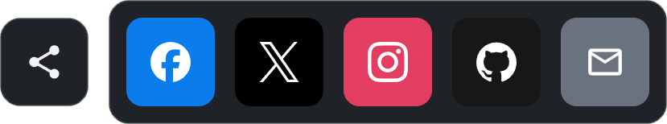

<p align="center">
  
</p>

<h1 align="center">Neiki's Social Bar</h1>

<p align="center">
  
  
  
  
  <br>
  
  
</p>

<p align="center">
  <b>Lightweight, CDN-ready Social Links Web Component</b><br>
  <i>Zero dependencies, framework-independent, drop into any page.</i>
</p>

<p align="center">
  
  
  
  
</p>

---

<p align="center">
  
</p>

---


**Live version:** [https://neikiri.dev/social-bar](https://neikiri.dev/social-bar)

---

## Overview

Neiki's Social Bar is a Web Component written in plain JavaScript with **zero dependencies**. Drop a single `<neiki-social-bar>` tag onto a page and get an accessible, responsive, themeable set of social links — floating, sticky, inline, top, or bottom — with no framework, bundler, or build step required.

```html
<script src="https://cdn.neikiri.dev/neiki-social-bar/neiki-social-bar.min.js"></script>

<neiki-social-bar
  facebook="https://facebook.com/example"
  x="https://x.com/example"
  github="https://github.com/example"
></neiki-social-bar>
```

That snippet is a complete, working social bar. From there you can configure position, theme, shape, size, display mode, collapsible behavior, and add custom links through attributes or JavaScript.

---

## Why Neiki's Social Bar?

- **One script, no dependencies.** The component ships as a single custom element. No React, Vue, Svelte, or Angular required — it works in plain HTML just as well as inside any framework.
- **CDN-ready.** Load it from jsDelivr or unpkg and start using `<neiki-social-bar>` immediately.
- **Safe with multiple instances.** Load the script more than once, or use dozens of bars on one page — the custom element registers itself once, and the icon loader is shared and deduplicated automatically.
- **Highly configurable.** 11 positions, 5 themes, 4 shapes, 3 sizes, 3 display modes, 3 color modes, and 2 orientations, controllable via HTML attributes, a JavaScript config object, or CSS variables.
- **Accessible by design.** Semantic links, meaningful `aria-label`s, visible focus states, full keyboard support, reduced-motion awareness, and custom accessible tooltips for icon-only mode.
- **Secure by default.** URLs are normalized and validated against an allow-list of protocols; dangerous schemes like `javascript:` are rejected before they ever reach the DOM.
- **Reliable icons.** Brand icons are loaded on demand from the [Iconify](https://iconify.design/) CDN (Simple Icons + Material Design Icons), so there is no giant inline SVG collection bloating the bundle.

---

## Getting started

The recommended install is the single bundled script from the CDN.

```html
<script src="https://cdn.neikiri.dev/neiki-social-bar/neiki-social-bar.min.js"></script>
```

<details>
<summary><b>Other installation options</b> (pinned version, jsDelivr, unpkg, npm, self-hosted)</summary>
<br>

**Pin a specific version (recommended for production)**

```html
<script src="https://cdn.neikiri.dev/neiki-social-bar/1.0.0/neiki-social-bar.min.js"></script>
```

**Load CSS and JS separately**

```html
<!-- Latest -->
<link rel="stylesheet" href="https://cdn.neikiri.dev/neiki-social-bar/neiki-social-bar.css">
<script src="https://cdn.neikiri.dev/neiki-social-bar/neiki-social-bar.js"></script>

<!-- Or pinned -->
<link rel="stylesheet" href="https://cdn.neikiri.dev/neiki-social-bar/1.0.0/neiki-social-bar.css">
<script src="https://cdn.neikiri.dev/neiki-social-bar/1.0.0/neiki-social-bar.js"></script>
```

**Alternative CDN — jsDelivr**

```html
<script src="https://cdn.jsdelivr.net/npm/neiki-social-bar@latest/dist/neiki-social-bar.min.js"></script>
<!-- Pinned -->
<script src="https://cdn.jsdelivr.net/npm/neiki-social-bar@1.0.0/dist/neiki-social-bar.min.js"></script>
```

**Alternative CDN — unpkg**

```html
<script src="https://unpkg.com/neiki-social-bar@1.0.0/dist/neiki-social-bar.min.js"></script>
```

**Package manager**

```bash
npm install neiki-social-bar
# or
yarn add neiki-social-bar
# or
pnpm add neiki-social-bar
```

**Self-hosted**

```html
<script src="path/to/dist/neiki-social-bar.min.js"></script>
```

The built `dist/neiki-social-bar.min.js` bundles its CSS inline — one file is all you need, no separate stylesheet to keep track of. `dist/neiki-social-bar.css` and `.min.css` are also published for reference (e.g. to preview the default styles or diff a customization), but the component never fetches them at runtime.

</details>

---

## Basic usage

```html
<neiki-social-bar
  position="floating-right"
  theme="auto"
  shape="rounded"
  size="medium"
  facebook="https://facebook.com/example"
  x="https://x.com/example"
  instagram="https://instagram.com/example"
  github="https://github.com/example"
  email="hello@example.com"
></neiki-social-bar>
```

Multiple instances can coexist on the same page, each with independent configuration:

```html
<neiki-social-bar position="inline" size="small" github="https://github.com/example"></neiki-social-bar>
<neiki-social-bar position="bottom-right" size="medium" theme="dark" discord="https://discord.gg/example"></neiki-social-bar>
```

---

## JavaScript configuration

```javascript
document.querySelector('neiki-social-bar').setConfig({
  position: 'floating-right',
  theme: 'auto',
  shape: 'rounded',
  size: 'medium',
  links: {
    github: 'https://github.com/neikiri',
    website: 'https://example.com'
  }
});
```

Custom, non-default links are supported too — pass any key with a URL, label, icon, and color:

```javascript
bar.addLink('mastodon', 'https://mastodon.social/@example', {
  label: 'Mastodon',
  icon: 'simple-icons:mastodon',
  color: '#6364FF'
});
```

Icon values use [Iconify](https://icon-sets.iconify.design/) `collection:name` identifiers.

---

## Supported platforms

| Key | Platform |
|-----|----------|
| `facebook` | Facebook |
| `x` | X (Twitter) |
| `instagram` | Instagram |
| `linkedin` | LinkedIn |
| `youtube` | YouTube |
| `tiktok` | TikTok |
| `github` | GitHub |
| `gitlab` | GitLab |
| `discord` | Discord |
| `email` | Email (normalized to `mailto:`) |
| `website` | Website |
| `rss` | RSS feed |

Any other key can be added through `setLinks()` / `addLink()` with an explicit `icon`.

---

## Attributes

| Attribute | Values | Default | Description |
|-----------|--------|---------|--------------|
| `position` | `inline`, `floating-left`, `floating-right`, `top`, `bottom`, `sticky-left`, `sticky-right`, `top-left`, `top-right`, `bottom-left`, `bottom-right` | `inline` | Where the bar is placed on the page |
| `theme` | `light`, `dark`, `auto`, `glass`, `minimal` | `auto` | Visual theme |
| `shape` | `square`, `rounded`, `pill`, `circle` | `rounded` | Icon/container shape |
| `size` | `small`, `medium`, `large` | `medium` | Overall size |
| `orientation` | `horizontal`, `vertical`, `auto` | `auto` | Layout direction |
| `display` | `icons`, `labels`, `icons-labels` | `icons` | What is shown per link |
| `color` | `brand`, `monochrome`, `custom` | `brand` | Icon color strategy |
| `collapsible` | boolean attribute | off | Enables an expand/collapse toggle |
| `collapsed` | boolean attribute | off | Starts the bar collapsed (requires `collapsible`) |
| `label` | string | `Social links` | Accessible name for the bar (and, when collapsible, for the toggle) |
| `facebook`, `x`, `instagram`, `linkedin`, `youtube`, `tiktok`, `github`, `gitlab`, `discord`, `email`, `website`, `rss` | URL / email | — | Sets the corresponding platform link |

---

## Methods

```javascript
const bar = document.querySelector('neiki-social-bar');

bar.setConfig({ theme: 'dark', size: 'large' }); // merge partial config, returns `bar`
bar.getConfig();                                 // full resolved config, incl. links
bar.setLinks({ github: 'https://github.com/x' }); // replaces all links
bar.addLink('github', 'https://github.com/x');    // adds or updates a single link
bar.removeLink('github');                         // removes a single link

bar.show();     // makes the bar visible
bar.hide();     // hides the bar (display: none)
bar.toggle();   // toggles collapsed state (collapsible mode)
bar.open();     // expands the bar (collapsible mode)
bar.close();    // collapses the bar (collapsible mode)
bar.refresh();  // re-renders from current config
```

`open()`, `close()` and `toggle()` are no-ops unless the `collapsible` attribute/config is enabled.

---

## Events

All events bubble and are composed (cross Shadow DOM boundary), with details on `event.detail`.

| Event | Fired when | `detail` |
|-------|------------|----------|
| `neiki-social-bar:ready` | The component finished its first render | `{ config }` |
| `neiki-social-bar:click` | A link is clicked | `{ platform, url, originalEvent }` |
| `neiki-social-bar:open` | The bar expands (collapsible mode) | `{ config }` |
| `neiki-social-bar:close` | The bar collapses (collapsible mode) | `{ config }` |
| `neiki-social-bar:change` | Config or links change | `{ config }` |
| `neiki-social-bar:error` | A link is rejected as unsafe or malformed | `{ platform, url, reason }` |

```javascript
bar.addEventListener('neiki-social-bar:click', (event) => {
  console.log(event.detail.platform, event.detail.url);
});
```

---

## CSS variables

All variables use the `--nsb-*` prefix and can be overridden per instance or globally:

```css
neiki-social-bar {
  --nsb-size: 48px;
  --nsb-icon-size: 22px;
  --nsb-gap: 12px;
  --nsb-radius: 12px;
  --nsb-accent: #7c3aed;
  --nsb-bg: #ffffff;
  --nsb-color: #1f2328;
}
```

| Variable | Purpose |
|----------|---------|
| `--nsb-size` | Link/button touch target size |
| `--nsb-icon-size` | Icon size |
| `--nsb-gap` | Space between links |
| `--nsb-radius` | Container border radius |
| `--nsb-padding` | Container inner padding |
| `--nsb-font-size` | Label font size |
| `--nsb-z-index` | Stacking order for fixed/sticky positions |
| `--nsb-transition` | Transition timing for hover/collapse |
| `--nsb-shadow` | Container box-shadow |
| `--nsb-bg` / `--nsb-bg-hover` | Container / hover background |
| `--nsb-color` / `--nsb-color-hover` | Text/icon color / hover color |
| `--nsb-border` | Container border color |
| `--nsb-accent` / `--nsb-focus-ring` | Accent and keyboard focus ring color |
| `--nsb-tooltip-bg` / `--nsb-tooltip-color` | Tooltip colors |

In `color="custom"` mode, set `--nsb-color` (and optionally `--nsb-color-hover`) to fully control the palette instead of per-brand colors.

---

## Themes

| Theme | Description |
|-------|-------------|
| `light` | Light card background, dark text, solid brand-color icon chips |
| `dark` | Dark card background, light text — pairs well with `color="monochrome"` for a clean, single-color icon set |
| `auto` | Follows `prefers-color-scheme`, updates live if the OS theme changes |
| `glass` | Translucent, blurred (`backdrop-filter`) background with a subtle highlight ring around each icon chip |
| `minimal` | No background, border, or shadow — flat icons with no chip, for the most understated look |

In `color="brand"` mode, `light`, `dark`, `glass` and `auto` render each link as a solid brand-color chip so every icon reads at the same visual weight regardless of the underlying artwork. `minimal` always flattens icons back to plain glyphs (no chip), and pairs naturally with `color="monochrome"` for a single-color, dark-friendly icon row like a classic sidebar of outline icons.

---

## Positions

`inline` renders in normal document flow. `floating-left` / `floating-right` fix the bar to the viewport's vertical center. `sticky-left` / `sticky-right` use `position: sticky`. `top` / `bottom` span a fixed bar across the viewport. `top-left`, `top-right`, `bottom-left`, `bottom-right` pin the bar to a corner.

---

## Accessibility

- Links are real `<a>` elements with `href`, and the collapsible toggle is a real `<button>` — no `div`-as-button anti-patterns.
- Every link has a descriptive `aria-label`; the bar itself has `role="navigation"` and an `aria-label` from the `label` attribute/config.
- Icon-only mode shows a custom, accessible tooltip on hover and keyboard focus (not the native `title` attribute).
- Collapsible mode exposes `aria-expanded` on the toggle button and removes collapsed links from the tab order (`tabindex="-1"`) to avoid a keyboard trap, restoring normal tab order on expand.
- Visible `:focus-visible` outlines on every interactive element.
- `prefers-reduced-motion: reduce` disables transitions.
- Colors default to sufficient contrast in both light and dark themes.

---

## Security

- URLs are parsed and validated; only `https:`, `http:`, and `mailto:` protocols are allowed. Anything else (e.g. `javascript:`) is rejected and the link is never rendered.
- Values that look like email addresses are automatically normalized to `mailto:` links.
- External links (`http:`/`https:`) get `rel="noopener noreferrer"` by default; `mailto:` links do not, since they do not open a new browsing context.
- Malformed input never throws — the affected link is skipped and a `neiki-social-bar:error` event is dispatched instead.

See [SECURITY.md](SECURITY.md) for the full policy and how to report vulnerabilities.

---

## Demo

Open [`demo/index.html`](demo/index.html) in a browser (or serve the repo locally) to see every position, theme, shape, size, display mode, color mode, collapsible mode, and the full JavaScript API in action.

---

## Build / minify

```bash
npm run build
```

Runs [`minify.py`](minify.py), which reads `src/neiki-social-bar.js` and `src/neiki-social-bar.css` and produces:

```
dist/neiki-social-bar.js       # CSS embedded inline, unminified
dist/neiki-social-bar.min.js   # CSS embedded inline, minified (recommended)
dist/neiki-social-bar.css      # standalone copy, for reference
dist/neiki-social-bar.min.css  # standalone copy, for reference
```

The CSS is baked directly into both JavaScript bundles at build time — loading either `dist` script is enough on its own, no separate stylesheet request required. JS minification uses [Terser](https://github.com/terser/terser) via `npx` when available, falling back to an unminified copy otherwise.

```bash
npm test
```

Runs `node --check` against the source file as a syntax sanity check.

---

## Browser support

Neiki's Social Bar uses Custom Elements v1, Shadow DOM, and standard DOM APIs, and targets current versions of modern browsers.

| Browser | Support |
|---------|---------|
| Chrome | Latest |
| Firefox | Latest |
| Safari | Latest |
| Edge | Latest |

> Internet Explorer is not supported.

---

## Contributing

Contributions are welcome. Please review [CONTRIBUTING.md](CONTRIBUTING.md) and the [CODE_OF_CONDUCT.md](CODE_OF_CONDUCT.md) before opening an issue or pull request. Security-related reports should follow [SECURITY.md](SECURITY.md).

The component source lives in `src/` (`neiki-social-bar.js`, `neiki-social-bar.css`); the distributable builds are in `dist/`.

---

## License

Released under the **MIT License**. See the [LICENSE](LICENSE) file for details.

---

<p align="center">
  Made with ❤️ for the web community
</p>
